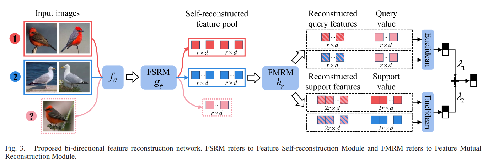
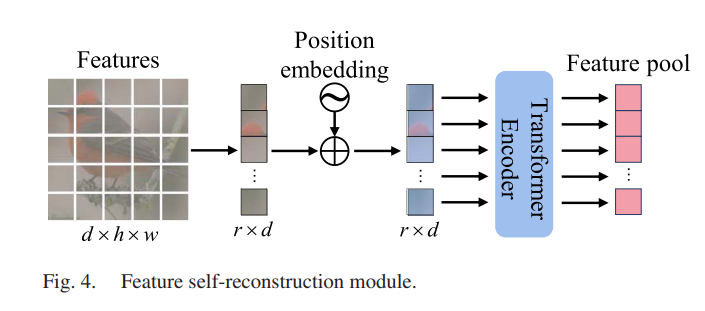
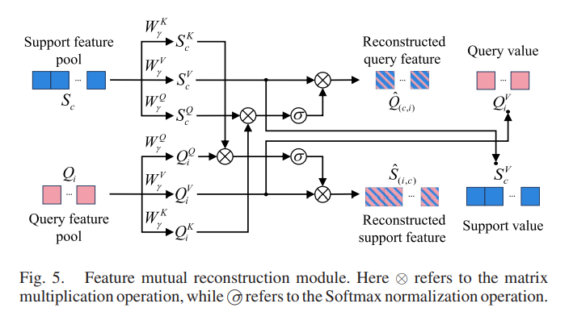
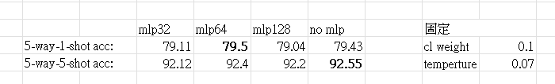
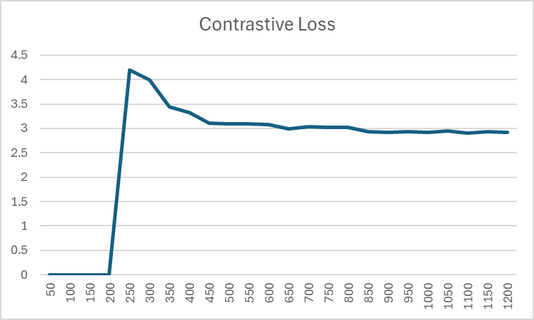

# XTFRN

前情提要，這是一個fewshot, fine-grained的classfy問題

fine-grained就是相似物件的分類，如現在這個資料集就是200種鳥類

--------------

目前遇到的問題:

添加入cl loss之後沒有表現得更好

不確定是在supcontrastive learning上實現上出現問題

還是說transformer在對比學習上沒有更多的效果

--------------

架構

Input: [600, 3, 84, 84]  

-> Backbone: [600, 64, 5, 5]  

-> FSRM: [600, 25, 64]  

--------------

[論文連結](https://arxiv.org/abs/2211.17161v2)

